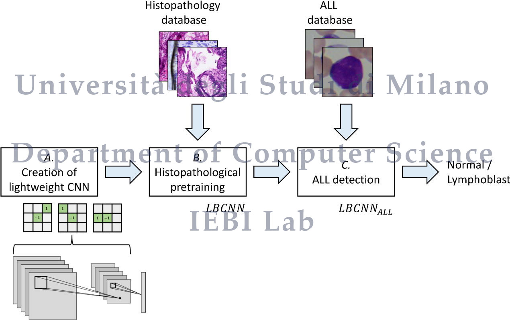

<div align="center">

# 🧬 ALLNet

### Acute Lymphoblastic Leukemia Detection using Lightweight Convolutional Networks

[](https://www.python.org/)
[](https://pytorch.org/)
[](https://pytorch.org/vision/)
[](LICENSE)
[](https://ieeexplore.ieee.org/document/9853691)
[](https://iebil.di.unimi.it/cnnALL/index.htm)

**Source code for the IEEE CIVEMSA 2022 paper**  
*ALLNet: Acute Lymphoblastic Leukemia Detection using lightweight convolutional networks*

</div>

---

## 🔬 Overview

**ALLNet** is a lightweight deep-learning pipeline for **Acute Lymphoblastic Leukemia (ALL) detection** from blood-cell images.

The repository implements a two-stage transfer-learning workflow:

1. **Pre-training** a lightweight convolutional network on the **Atlas of Digital Pathology (ADP)** dataset.
2. **Fine-tuning** the pre-trained model on the **ALL-IDB** dataset for ALL detection.

The approach is designed to exploit histopathological pre-training and adapt the learned visual representations to leukemic-cell classification.

---

## 🧠 Method at a Glance

<div align="center">



</div>

```text
ADP histopathology patches
        │
        ▼
LBCNN / lightweight CNN pre-training
        │
        ▼
Pre-trained models
        │
        ▼
Fine-tuning on ALL-IDB blood-cell images
        │
        ▼
Acute Lymphoblastic Leukemia detection
```

---

## ✨ Key Features

- 🧬 **ALL detection** from microscopic blood-cell images
- ⚡ **Lightweight convolutional architecture** based on LBCNN components
- 🔁 **Transfer-learning workflow** from ADP to ALL-IDB
- 🧪 **Two-stage experimental pipeline**: pre-training and fine-tuning
- 🐍 **Python / PyTorch implementation**
- 📄 Reproducible code accompanying the IEEE CIVEMSA 2022 paper

---

## 📁 Repository Structure

```text
ALLNet/
│
├── 0_PyTorch_ADP_HistoNet_LBCNN/
│   ├── pytorch_adp_histonet.py
│   └── lbcnn_pytorch/
│       └── requirements.txt
│
├── 1_PyTorch_ADP_HistoNet_LBCNN_fineTune_ALL_IDB/
│   ├── pytorch_adp_histonet_finetune_all.py
│   ├── pretrained_nets/
│   └── lbcnn_pytorch/
│       └── requirements.txt
│
├── LICENSE
└── README.md
```

---

## 🚀 Getting Started

### 1. Clone the repository

```bash
git clone https://github.com/AngeloUNIMI/ALLNet.git
cd ALLNet
```

### 2. Create a Python environment

Using Conda:

```bash
conda create -n allnet python=3.7
conda activate allnet
```

Install the required packages from the corresponding experiment folder:

```bash
cd 0_PyTorch_ADP_HistoNet_LBCNN/lbcnn_pytorch
pip install -r requirements.txt
```

The repository dependency graph reports the main framework versions as:

```text
pytorch == 1.4.0
torchvision == 0.5.0
tqdm
```

---

## 🗂 Dataset Preparation

### ADP dataset for pre-training

Download the **Atlas of Digital Pathology (ADP)** dataset from:

```text
https://www.dsp.utoronto.ca/projects/ADP/
```

Expected files and folders:

```text
ADP/img_res_1um_bicubic/
ADP/ADP_EncodedLabels_Release1_Flat.csv
```

The ADP images should be split into patches following the dataset instructions.

### ALL-IDB dataset for fine-tuning

Download the **Acute Lymphoblastic Leukemia Image Database for Image Processing (ALL-IDB)** from:

```text
https://homes.di.unimi.it/scotti/all/
```

Expected folder:

```text
ALL_IDB2/
```

---

## 🏃 Running the Pipeline

### Step 1 — Pre-train on ADP

```bash
cd 0_PyTorch_ADP_HistoNet_LBCNN
python pytorch_adp_histonet.py
```

This step trains the lightweight CNN on the ADP histopathology database.

### Step 2 — Copy pre-trained models

Copy the generated models into:

```text
1_PyTorch_ADP_HistoNet_LBCNN_fineTune_ALL_IDB/pretrained_nets/
```

Some pre-trained models may already be included for convenience.

### Step 3 — Fine-tune on ALL-IDB

```bash
cd 1_PyTorch_ADP_HistoNet_LBCNN_fineTune_ALL_IDB
python pytorch_adp_histonet_finetune_all.py
```

This step fine-tunes the network for **Acute Lymphoblastic Leukemia detection** on ALL-IDB.

---

## 📊 Expected Workflow Outputs

Depending on the script configuration, the pipeline can produce:

| Stage | Output |
|---|---|
| ADP pre-training | Trained lightweight CNN models |
| Model transfer | Pre-trained checkpoints for fine-tuning |
| ALL-IDB fine-tuning | ALL classification model |
| Evaluation | Classification performance on ALL-IDB |

---

## 📚 Datasets

| Dataset | Purpose | Link |
|---|---|---|
| **ADP — Atlas of Digital Pathology** | Histopathology pre-training | https://www.dsp.utoronto.ca/projects/ADP/ |
| **ALL-IDB** | Acute Lymphoblastic Leukemia detection | https://homes.di.unimi.it/scotti/all/ |

### ADP Reference

Mahdi S. Hosseini, Lyndon Chan, Gabriel Tse, Michael Tang, Jun Deng, Sajad Norouzi, Corwyn Rowsell, Konstantinos N. Plataniotis, and Savvas Damaskinos,  
**“Atlas of Digital Pathology: A Generalized Hierarchical Histological Tissue Type-Annotated Database for Deep Learning,”**  
*Proceedings of the IEEE/CVF Conference on Computer Vision and Pattern Recognition (CVPR)*, 2019, pp. 11747–11756.

### ALL-IDB Reference

R. Donida Labati, V. Piuri, and F. Scotti,  
**“ALL-IDB: the acute lymphoblastic leukemia image database for image processing,”**  
*Proc. of the 2011 IEEE International Conference on Image Processing (ICIP 2011)*, Brussels, Belgium, pp. 2045–2048, September 11–14, 2011.  
DOI: `10.1109/ICIP.2011.6115881`

---

## 📖 Paper

If you use this code, please cite:

```bibtex
@InProceedings{civemsa22_all,
  author    = {A. Genovese},
  booktitle = {Proc. of the 2022 IEEE Int. Conf. on Computational Intelligence and Virtual Environments for Measurement Systems and Applications (CIVEMSA 2022)},
  title     = {ALLNet: Acute Lymphoblastic Leukemia Detection using lightweight convolutional networks},
  address   = {Chemnitz, Germany},
  pages     = {1--6},
  month     = {June},
  day       = {15--17},
  year      = {2022},
  note      = {Accepted}
}
```

Paper:

```text
https://ieeexplore.ieee.org/document/9853691
```

Project page:

```text
https://iebil.di.unimi.it/cnnALL/index.htm
```

---

## 👤 Author

**Angelo Genovese**  
Department of Computer Science  
Università degli Studi di Milano, Italy

---

## 📄 License

This project is released under the **GNU General Public License v3.0**.

See the [LICENSE](LICENSE) file for details.
